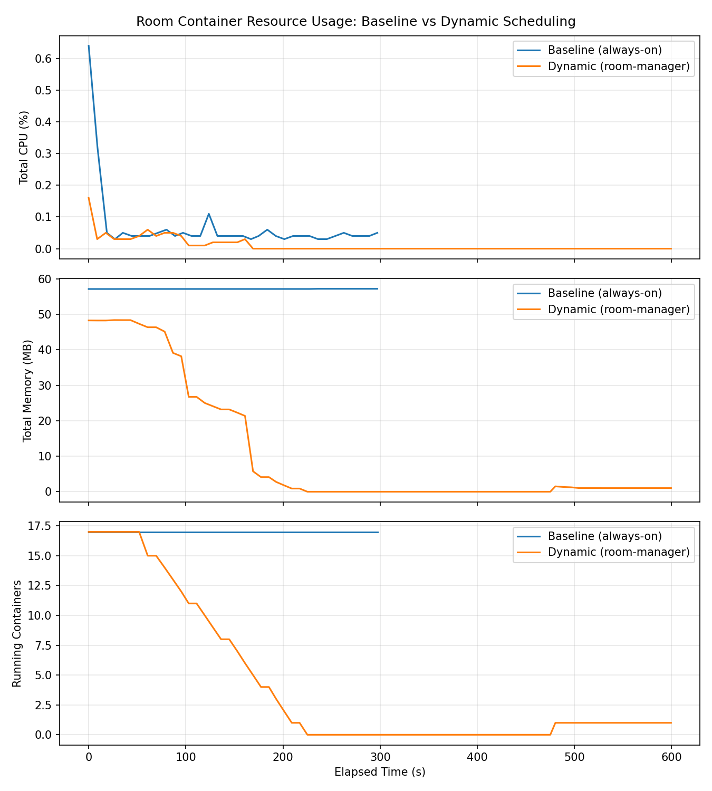

# 實驗分析：room-manager On-Demand 房間生命週期管理的資源效益

## 1. 實驗目的

Escape Docker 的 12 個主關卡 + Final Boss + 2 個 Secret Room + 連動容器，共 17 個 room container。
傳統做法（`docker-compose.yml` 全部 `restart: unless-stopped`）會讓這 17 個 container **從第一次 `docker compose up -d` 開始就全程常駐**，無論玩家有沒有在玩。

`room-manager` 服務改為 **on-demand 生命週期管理**：

- 玩家連線時才 `ensure`（啟動）對應房間的 container
- 房間閒置超過 `ROOM_STOP_IDLE_MINUTES` 後自動 `stop`（保留檔案系統，下次秒開）
- 房間「停止狀態」閒置超過 `ROOM_RESET_IDLE_MINUTES` 後 `--force-recreate`，恢復成乾淨初始狀態（FLAG、檔案系統重置）

本實驗的目的，是用實際數據回答：**這個設計能為「邊緣運算」場景節省多少資源？**

## 2. 實驗設計

| | 模式 A（Baseline） | 模式 B（Dynamic） |
|---|---|---|
| 設定 | `ROOM_STOP_IDLE_MINUTES=99999` `ROOM_RESET_IDLE_MINUTES=999999`（等同停用自動管理） | `ROOM_STOP_IDLE_MINUTES=1` `ROOM_RESET_IDLE_MINUTES=30` |
| 行為 | 17 個 room container 全程常駐 running | room-manager 啟動約 1 分鐘後，依序自動 stop 所有閒置房間 |
| 記錄時長 | 5 分鐘 | 10 分鐘（含中途喚醒一個房間） |
| 採樣方式 | `docker stats --no-stream`，每 5 秒一次，記錄每個 container 的 `state` / CPU% / 記憶體用量 |

實驗腳本：`monitor_resources.py`（採樣與寫入 CSV）、`plot_resources.py`（彙總畫圖）。
原始資料：`baseline.csv`（模式 A）、`dynamic.csv`（模式 B）。

模式 B 的時間軸：
1. **t = 0s**：room-manager 重啟，所有 17 個 container 為 running
2. **t ≈ 60–225s**：idle-sweeper 第一輪掃描，依序對 17 個 container 執行 `docker stop`（每個約間隔 10 秒，因 `docker stop` 預設等 10 秒 SIGTERM 才送 SIGKILL）
3. **t ≈ 225–480s**：所有房間維持 stopped，資源用量歸零
4. **t ≈ 480s**：呼叫 `room0` 的 `/rooms/room0/ensure`（模擬玩家進入房間），room0 在 1 秒內恢復 running
5. **t = 600s**：記錄結束，room0 維持 running

## 3. 結果數據

| 指標 | 模式 A（Baseline） | 模式 B（Dynamic） | 節省幅度 |
|---|---:|---:|---:|
| 平均運行 container 數 | 17.0 / 17 | 3.2 / 17 | **81.2%** |
| 平均總記憶體用量 | 57.18 MB | 8.51 MB | **85.1%** |
| 平均總 CPU 使用率 | 0.069% | 0.008% | **88.1%** |
| 全部房間 stopped 時的記憶體 | — | 0.00 MB | — |

補充：單一閒置 room container 平均約佔 **3.36 MB** 記憶體（CPU 幾乎為 0），17 個房間全部常駐 baseline 約 57MB。

## 4. 結果分析

1. **靜態常駐的成本是「線性疊加」的固定成本**：即使玩家完全沒有互動，17 個 container 的記憶體用量也不會降為 0（baseline 全程穩定在 ~57MB）。隨著關卡數量增加（例如未來擴充到 20、30 關），這個固定成本會持續線性成長。

2. **on-demand 管理把成本變成「依使用量」**：模式 B 在沒有玩家連線時，總資源用量趨近於 0；只有「正在被使用」或「剛被使用、還在閒置緩衝期」的房間才佔用資源。在多人共用同一台主機、但同時在線人數遠少於關卡總數的場景（例如課堂展示、多組學生輪流闖關），這個差異會非常明顯。

3. **`docker stop` 而非 `remove`，喚醒成本極低**：因為是 `stop`（保留檔案系統與 container 設定）而非刪除，`/ensure` 喚醒一個房間只需 `docker start` + 一次 `exec true` 健康檢查，實測 **< 1 秒**完成，玩家幾乎無感。

4. **CPU 節省幅度（88.1%）大於記憶體節省幅度（85.1%）**：閒置 container 仍會被排入 cgroup 統計、偶爾有極小的背景開銷（log driver、health check 輪詢等），stop 之後這些開銷直接歸零，因此 CPU 的相對節省比記憶體更明顯。

## 5. 這個設計對應到「Linux 與邊緣運算」課程的哪些概念

- **資源排程（Resource Scheduling）**：room-manager 的 idle-sweeper 本質上是一個簡化版的「依需求調度」排程器——根據活躍連線數動態決定哪些 workload 該佔用運算資源，哪些該釋放。這正是邊緣運算環境（資源受限的邊緣節點）中常見的核心問題。

- **冷啟動 vs 常駐的取捨（Cold Start Trade-off）**：本實驗也間接示範了這個取捨——`stop`（秒級喚醒、零額外成本）與 `recreate`（較慢但能恢復乾淨狀態）是兩種不同代價/效益的選擇，分別對應 `ROOM_STOP_IDLE_MINUTES` 與 `ROOM_RESET_IDLE_MINUTES` 兩層閾值。

- **狀態與無狀態的分層管理**：透過「stop 保留狀態 / recreate 重置狀態」兩層機制，把「容錯與重置」也納入資源管理的一部分，而不只是單純的開關機。

- **可觀測性（Observability）**：`GET /api/rooms/status` 提供即時的房間運行狀態，可作為地圖頁面（map.html）房間徽章、或更進一步接到 Prometheus/Grafana 之類監控系統的資料來源。

## 6. 限制與後續工作

- 本機（單機 Docker Desktop）測得的數字僅供「相對比例」參考；在實際邊緣裝置（如樹莓派等資源受限環境）上，固定常駐成本占比可能更高，因此 on-demand 管理的相對效益預期會更明顯。
- 本實驗未測量「冷啟動延遲對玩家體感」的影響——`/ensure` 在 stop→start 情境下 < 1 秒，但 `/reset`（force-recreate）的延遲較高，可作為後續實驗方向（例如量測 `--force-recreate` 的平均耗時，評估 `ROOM_RESET_IDLE_MINUTES` 的合理下限）。
- `idle-sweeper` 目前是序列處理（逐一 `docker stop`），17 個房間全部停止耗時約 2.5 分鐘；未來可評估平行化以縮短第一輪掃描時間。

## 7. 結論

把 17 個 room container 從「全程常駐」改為「on-demand 啟停」，在閒置情境下可節省 **約 85% 記憶體、約 88% CPU、約 81% 的運行 container 數**，且喚醒延遲對玩家而言幾乎無感（< 1 秒）。這項設計不只是工程上的資源優化，也是「邊緣運算資源排程」這個課程主題的一個具體、可量測的實作案例。
