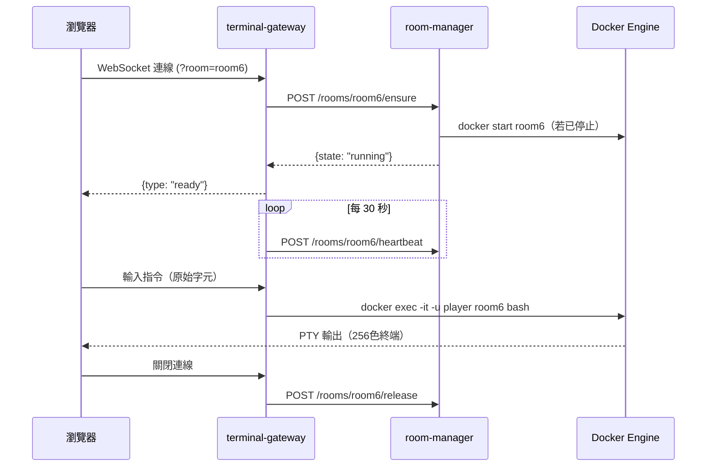

# Edge Container Security Lab

> **邊緣容器環境中的攻擊鏈自動化模擬與輕量偵測機制評估**
>
> Linux 與邊緣運算 — 期末專案報告

---

## 目錄

1. [專案概述](#1-專案概述)
2. [系統架構](#2-系統架構)
3. [Security Lab 核心模組](#3-security-lab-核心模組)
4. [攻擊場景設計（RQ1）](#4-攻擊場景設計rq1)
5. [實驗設計與結果](#5-實驗設計與結果)
6. [room-manager 動態排程](#6-room-manager-動態排程)
7. [Story Mode：互動式密室逃脫](#7-story-mode互動式密室逃脫)
8. [核心技術實作](#8-核心技術實作)
9. [技術挑戰與解決方案](#9-技術挑戰與解決方案)
10. [部署說明](#10-部署說明)
11. [附錄：目錄結構](#11-附錄目錄結構)

---

## 1. 專案概述

### 1.1 研究動機

邊緣裝置（Edge Devices）近年大量被部署為容器執行節點，但與雲端環境相比，邊緣節點在以下三個維度面臨更嚴峻的限制：

- **資源受限**：記憶體通常在 2–8 GB，無法常駐完整監控堆疊
- **維護困難**：偏遠部署、無法即時人工介入
- **安全配置複雜**：容器錯誤配置（docker.sock 暴露、SUID 誤設、網路隔離缺失）在邊緣環境更常見

現有研究多以雲端叢集為對象評估 Falco 等規則式偵測器，尚缺乏針對邊緣單節點環境的系統性實驗。本專案建立一套完整的**攻擊模擬與偵測評估平台**，以自動化方式測試 15 種真實容器錯誤配置場景，並量化 Falco 在資源受限環境中的偵測效能。

### 1.2 研究問題

| 編號 | 研究問題 |
|------|---------|
| **RQ1** | 如何依攻擊能力與危害範圍對容器錯誤配置進行風險分級？ |
| **RQ2** | Falco 規則式偵測器在各場景的偵測有效性為何（規則覆蓋率、偵測延遲、誤報率）？ |
| **RQ3** | 在邊緣環境中部署 Falco 的資源開銷為何（穩態 CPU/記憶體 + 告警積壓的瞬時影響）？ |

### 1.3 系統規模

| 項目 | 數量 |
|------|------|
| 攻擊場景 | 15 個（對應 15 種容器錯誤配置） |
| 管理服務 | 6 個（nginx / terminal-gateway / scoreboard-api / room-manager / lab-api / falco） |
| 遊戲容器 | 22 個 |
| Docker 網路 | 4 個 |
| Falco 規則（Basic / Full tier） | 8 / 31 條 |
| Lab 前端頁面 | 3 個（控制台 / 即時檢視 / 分析儀表板） |
| Story Mode 關卡 | 15 關（含 2 個隱藏關） |
| 程式碼檔案 | 70+ 個 |

### 1.4 兩個功能模組

本系統包含兩個互補模組，共用同一批容器場景：

```
Edge Container Security Lab
  │
  ├─ Security Lab（主模組）
  │   ├─ 自動化攻擊腳本執行（lab-api）
  │   ├─ 即時 Falco 偵測觀察（WebSocket 串流）
  │   └─ 分析儀表板（RQ1 / RQ2 / RQ3）
  │
  └─ Story Mode（副模組）
      ├─ 互動式密室逃脫（xterm.js 終端機）
      └─ 計分 / 成就 / 提示系統（scoreboard-api）
```

---

## 2. 系統架構

### 2.1 整體架構圖

```
  瀏覽器 (http://localhost)
          │
          │ HTTP / WebSocket
          ▼
  ┌─────────────────────────────────────────────────────┐
  │                   Nginx  :80                         │
  │                                                     │
  │  /           → frontend 靜態檔案                    │
  │  /ws         → terminal-gateway :3001  (WebSocket)  │
  │  /api/       → scoreboard-api :8000                 │
  │  /api/rooms/ → room-manager :4000                   │
  │  /api/lab/   → lab-api :4100                        │
  │  /api/lab/runs/:id/stream → lab-api (WebSocket)     │
  └───┬──────┬──────┬──────┬──────┬────────────────────┘
      │      │      │      │      │
      ▼      ▼      ▼      ▼      ▼
  ┌───────┐ ┌────┐ ┌────────┐ ┌─────────┐ ┌──────────┐
  │term-  │ │scr-│ │ room-  │ │ lab-api │ │  falco   │
  │gateway│ │api │ │manager │ │  :4100  │ │(syscall) │
  │ :3001 │ │:8000│ │ :4000  │ │         │ │          │
  └───┬───┘ └────┘ └───┬────┘ └────┬────┘ └────┬─────┘
      │                │            │           │
      │docker exec      │docker.sock │exec+stats │webhook
      │                │            │           │
      ▼                ▼            ▼           ▼
  ┌───────────────────────────────────────────────────┐
  │              Docker Engine                         │
  │                                                   │
  │  room0  room1  room2  room3  room4  room5          │
  │  room6  room7  room8  room9  room10 room11         │
  │  final  secret-a  secret-b                        │
  │  locked-server  secret-server  vault               │
  │  ghost-alpha/beta/gamma/delta                      │
  └───────────────────────────────────────────────────┘
```

### 2.2 管理服務清單

| 服務 | 技術棧 | 內部 Port | 職責 |
|-----|--------|---------|------|
| **nginx** | Nginx Alpine | 80 | 統一入口、反向代理、靜態檔案服務 |
| **terminal-gateway** | Node.js + ws + node-pty | 3001 | WebSocket ↔ docker exec PTY 橋接 |
| **scoreboard-api** | FastAPI + SQLite | 8000 | FLAG 驗證、排行榜、成就、提示 |
| **room-manager** | Node.js + dockerode | 4000 | 動態容器生命週期管理（按需啟停） |
| **lab-api** | Node.js + Express | 4100 | 攻擊腳本執行引擎、Falco 告警收集、分析 API |
| **falco** | falco-no-driver（privileged） | — | 容器行為監控（syscall / eBPF 層） |

### 2.3 Docker 網路拓撲

```
game_net  172.20.0.0/24
  └─ 所有服務與房間容器（共用主幹網路）

docker_net  172.21.0.0/24
  └─ room6/7/8/final + vault + ghost-alpha/beta/gamma/delta
     （有 docker.sock 存取需求的 Docker 進階場景）

secret_net  172.22.0.0/24  [internal: true]
  └─ room9 + secret-server
     （完全隔離，禁止外網連線；Room 9 橫向移動謎題核心）

ssh_net  172.23.0.0/24
  └─ room4 + locked-server
     （SSH 金鑰跳板練習的專屬網路）
```

| 網路 | Subnet | internal | 用途 |
|------|--------|---------|------|
| game_net | 172.20.0.0/24 | 否 | 所有服務主幹 |
| docker_net | 172.21.0.0/24 | 否 | Docker 進階容器 |
| secret_net | 172.22.0.0/24 | **是** | Room 9 隔離謎題 |
| ssh_net | 172.23.0.0/24 | 否 | Room 4 SSH 跳板 |

### 2.4 Nginx 路由規則

| 路徑 | Upstream | 協定 | 說明 |
|------|----------|------|------|
| `/` | 前端靜態 | HTTP | index.html / map.html 等 |
| `/ws` | terminal-gateway:3001 | **WebSocket** | xterm.js 終端機 |
| `/api/` | scoreboard-api:8000 | HTTP | FLAG / 排行榜 / 成就 |
| `/api/rooms/status` | room-manager:4000 | HTTP | 房間狀態查詢 |
| `/api/rooms/(.+)` | room-manager:4000/rooms/$1 | HTTP | ensure / heartbeat / release / reset |
| `/api/lab/runs/:id/stream` | lab-api:4100 | **WebSocket** | 攻擊步驟即時串流 |
| `/api/lab/` | lab-api:4100 | HTTP | 場景 / 執行紀錄 / 分析 |

---

## 3. Security Lab 核心模組

### 3.1 Lab 執行管線架構

```
使用者點擊「執行場景」
       │
       ▼
POST /api/lab/runs  (lab-api)
       │
       ├─ POST /rooms/:id/reset  → room-manager（確保容器乾淨）
       │
       ├─ 設定 Falco tier（basic / full）
       │       → 套用對應規則檔，重新掛載 Falco
       │
       ├─ 執行攻擊腳本
       │       → docker exec -u player <container> bash exploits/<id>.sh
       │
       │  ┌── 即時事件（JSON Lines） ──┐
       │  │  step / result / error   │
       │  └──────────────────────────┘
       │                │
       │   WebSocket /api/lab/runs/:id/stream
       │                │
       │             瀏覽器（run.html）
       │
       ├─ 接收 Falco 告警
       │       → POST /api/lab/falco-webhook（Falco 主動推送）
       │       → 記錄：規則名、嚴重性、時間戳
       │
       └─ 完成後 POST /rooms/:id/reset（恢復容器初始狀態）
```

### 3.2 攻擊腳本設計

**腳本位置**：`lab/exploits/<scenario_id>.sh`（15 支），共用函式庫 `lab/exploits/lib/common.sh`

**輸出格式**（JSON Lines，每行一個事件）：

```json
{"type":"step","name":"找尋 FLAG 所在路徑","output":"find /home -name '*.encoded'","exit_code":0,"duration_ms":312}
{"type":"step","name":"Base64 解碼","output":"EscapeDocker{a3f8c1d2e4b7f9a0}","exit_code":0,"duration_ms":28}
{"type":"result","status":"success","flag_found":"EscapeDocker{a3f8c1d2e4b7f9a0}","final_privilege":"player","duration_ms":2341}
```

**特殊功能**：room6 啟用 `step_traced()`，記錄 strace ground truth（execve / openat / connect syscall），作為 Falco 偵測的地面真相對照。

**執行結果欄位**：

| 欄位 | 說明 |
|------|------|
| `status` | success / failed / timeout |
| `flag_found` | 取得的 FLAG 字串或 null |
| `final_privilege` | player / root / docker-daemon |
| `duration_ms` | 總執行時間 |

### 3.3 Falco 規則層級

系統提供兩個規則 Tier，可在儀表板即時切換：

| Tier | 規則數 | 策略 | 適用場景 |
|------|--------|------|---------|
| **Basic** | 8 條 | 高信度、低誤報 | 邊緣設備長期部署 |
| **Full** | 31 條 | 廣覆蓋、誤報較高 | 安全審計、完整評估 |

**Basic Tier 主要覆蓋範圍**：sudo 執行、docker.sock 存取、cron 派生行程、SUID 二進位執行

**Full Tier 額外規則**：find 遞迴掃描、base64 解碼、SSH pattern、proc/sys 存取等

### 3.4 前端介面

**Lab 模組共 3 個頁面**（位於 `frontend/lab/`）：

#### 實驗控制台（`lab/index.html`）

- **場景卡片網格**：15 張卡片，各顯示場景 ID、攻擊類型 badge、上次執行的偵測率/覆蓋率/誤報率
- **狀態點**：綠（已偵測）/ 灰（未執行）/ 紅（未偵測）
- **Tier 切換橫條**：Basic / Full 即時切換
- **批次操作**：一鍵執行全部場景、全部 Baseline（15×20秒靜置）
- **執行歷史**：最近 30 筆紀錄（場景、類型、狀態、FLAG 取得、耗時）

#### 即時檢視（`lab/run.html`）

- **左側：步驟面板** — 每個 step 卡片顯示指令、輸出、exit code、耗時
  - Pilot 功能：room6 顯示 strace ground truth（execve / openat / connect）
- **右側：Falco 告警 Feed** — 即時 prepend，顯示規則名、嚴重性（彩色邊框）、時間戳

#### 分析儀表板（`lab/analytics.html`）

- **Tab**：All / Full / Basic / Tier 對比
- **摘要卡片**：執行次數、偵測率、規則覆蓋率、誤報率
- **圖表（RQ2）**：規則覆蓋率 vs 誤報率棒圖、偵測延遲分布圖、覆蓋率×誤報率散佈圖
- **圖表（Tier 對比）**：Basic vs Full 覆蓋率對比、誤報率對比、每日告警傳輸量估算
- **資源開銷表格（RQ3）**：Falco / lab-api / room-manager 的 CPU / 記憶體快照

### 3.5 Lab-API 端點清單

| 方法 | 路徑 | 功能 |
|------|------|------|
| GET | `/api/lab/scenarios` | 列出 15 個場景中繼資料 |
| GET | `/api/lab/scenarios/:id` | 單一場景完整細節 |
| POST | `/api/lab/runs` | 啟動一次攻擊實驗（非同步） |
| POST | `/api/lab/baseline-runs` | 啟動 20 秒 Baseline（靜置誤報量測） |
| GET | `/api/lab/runs` | 歷史執行清單 |
| GET | `/api/lab/runs/:id` | 單次執行詳情 |
| GET (WS) | `/api/lab/runs/:id/stream` | 即時串流（step / alert / result） |
| POST | `/api/lab/falco-webhook` | Falco 告警接收端點（由 Falco 主動推送） |
| GET | `/api/lab/analytics/detection-matrix` | 15 場景彙整：覆蓋率、延遲、誤報率 |
| GET | `/api/lab/analytics/resource-usage` | docker stats 快照 |
| POST | `/api/lab/falco-tier` | 切換 Falco 規則 Tier |

---

## 4. 攻擊場景設計（RQ1）

### 4.1 風險分級框架

依照**攻擊能力**與**潛在危害範圍**，將 15 個場景分為四個風險等級：

| 等級 | 名稱 | 定義 | 代表危害 |
|------|------|------|---------|
| **T1** | 資訊洩漏 | 不需提權，直接讀取洩漏的機密 | 配置錯誤導致明文 FLAG / token 可讀 |
| **T2** | 容器內提權 | 利用容器內的錯誤配置取得 root | SUID 誤設、sudo 設定不當 |
| **T3** | 橫向移動 | 從一個容器移動到另一個容器或網段 | SSH 跳板、內網穿透 |
| **T4** | Host 等級控制 | 透過 docker.sock 控制 Docker daemon | 等同取得主機 root 權限 |

### 4.2 場景總覽

| 場景 | 房間名稱 | 等級 | 攻擊類型 | 錯誤配置描述 |
|------|---------|------|---------|------------|
| room0 | Tutorial | T1 | 資訊洩漏 | FLAG 明文寫在 /etc/motd |
| room1 | The Archive | T1 | 弱混淆 | 僅 base64 編碼，混在大量假檔案中 |
| room2 | The Vault | T2 | sudo 引數注入 | sudo NOPASSWD 腳本缺少引數引號保護 |
| room3 | The Process | T1 | 行程信號 | FLAG daemon 透過 SIGUSR1 觸發輸出 |
| room4 | The Locksmith | T3 | SSH 跳板 | locked-server 共享 volume 可植入 authorized_keys |
| room5 | The Wire | T1 | 服務探測 | FLAG 服務監聽特定 port，需謎語驗證 |
| room6 | The Shipyard | T4 | docker.sock (唯讀) | 唯讀 socket 仍可對 API 呼叫取得跨容器機密 |
| room7 | The Workshop | T4 | docker.sock (可寫) | 可寫 socket 可執行任意容器操作 |
| room8 | The Fleet | T1 | Compose 設定缺陷 | docker-compose.yml 缺少必要環境變數 |
| room9 | Network Maze | T3 | 網路隔離突破 | 手動 docker network connect 進入 internal 網路 |
| room10 | The Evidence | T1 | 日誌洩漏 | session token 以明文寫入 app.log |
| room11 | The Clockwork | T2 | Cron 注入 | root cron job 讀取玩家可寫的 key 檔案 |
| final | The Escape | T4 | docker.sock RCE | 完整 Docker REST API 控制，存取 vault 容器取得 FLAG |
| secret-a | The Leak | T1 | ENV 變數洩漏 | LEAKED_SECRET 透過 docker inspect 可見 |
| secret-b | The Ghost | T4 | Image layer 挖掘 | 已刪除的 FLAG 仍存在於舊 image layer |

### 4.3 代表性場景詳細說明

#### T1 代表：room10 — 應用層日誌洩漏（Falco 結構性盲區）

**錯誤配置**：應用程式將 session token（即 FLAG）以明文格式記錄至 `app.log`，屬於開發階段「方便除錯」遺留的記錄習慣。

**攻擊流程**：
1. 分析 `auth.log`，找出 SSH 暴力攻擊的來源 IP（`192.168.1.100`）
2. 在 `nginx.log` 追蹤該 IP 存取了 `/api/v1/users/export`
3. 對應到 `app.log` 中的 session token 記錄

```bash
grep "192.168.1.100" nginx.log | awk '{print $7}' | sort -u
grep "session token" app.log
```

**Falco 偵測結果**：**規則覆蓋率 = null（結構性盲區）**  
原因：整個攻擊過程僅涉及 `cat` / `grep` 等正常檔案讀取操作，Falco 監控的 syscall 模式與日常使用無異，無法區分「正常讀 log」與「攻擊者讀 log」。

**結論**：Falco（syscall / eBPF 層）與 SIEM 日誌內容稽核互補，而非取代關係。

---

#### T2 代表：room2 — Sudo 引數注入提權

**錯誤配置**：`/usr/local/bin/backup.sh` 以 sudo NOPASSWD 執行，但腳本參數未加引號：

```bash
# backup.sh（有漏洞的版本）
cp $1 /tmp/out   # $1 未加引號 → 路徑注入
```

**攻擊流程**：

```bash
sudo -l                                    # 發現 NOPASSWD: backup.sh
sudo /usr/local/bin/backup.sh /secret/flag.txt
cat /tmp/out                               # 讀到 root 擁有的 FLAG
```

**Falco 偵測**：規則覆蓋率 100%，觸發 `Sudo Privilege Escalation` 告警。

---

#### T3 代表：room4 — SSH 跳板 + Port Forwarding

**錯誤配置**：room4 與 locked-server 共享 Docker volume（`locked_server_ssh`），掛載為 locked-server 的 `~/.ssh/`，玩家可直接寫入 `authorized_keys`。

**攻擊流程**：

```bash
ssh-keygen -t ed25519 -f /tmp/mykey -N ""
cat /tmp/mykey.pub >> /home/player/locked-server-ssh/authorized_keys

# SSH 連線（public key 已被植入）
ssh -i /tmp/mykey player@locked-server -L 9090:localhost:9090 &

# 透過 SSH Tunnel 存取 FLAG 服務
curl http://localhost:9090/flag
```

**Falco 偵測**：規則覆蓋率 87.5%，觸發 `SSH Key-Based Lateral Movement` 相關告警。

---

#### T4 代表：room6 — 唯讀 docker.sock 仍可 RCE

**錯誤配置**：容器掛載 `/var/run/docker.sock`（唯讀），開發者以為唯讀就安全。

**攻擊流程**：

```bash
# 透過唯讀 socket 呼叫 Docker REST API
curl --unix-socket /var/run/docker.sock http://localhost/containers/json

# 對其他容器（ghost-alpha/beta/gamma/delta）執行 logs / inspect / exec
curl --unix-socket /var/run/docker.sock \
  "http://localhost/containers/ghost-delta/logs?stdout=true"
```

**核心發現**：唯讀掛載只限制 socket 的 POSIX 寫入，但 Docker API 本身是無狀態的 HTTP，`docker exec`、`docker logs`、`docker inspect` 等操作的語義「讀取」能力完全保留。

**Falco 偵測**：規則覆蓋率 91.7%。

---

## 5. 實驗設計與結果

### 5.1 RQ2：Falco 偵測有效性

#### 實驗方法

- **攻擊實驗**：對每個場景自動執行攻擊腳本，收集 Falco 告警
- **Baseline 實驗**：容器啟動後靜置 20 秒，量測無攻擊時的背景告警率（誤報基準）
- **Falco Webhook**：Falco 主動推送告警至 lab-api，精確計算「偵測延遲 = 第一筆相關告警時間 − 攻擊開始時間」

#### 量測指標定義

| 指標 | 定義 |
|------|------|
| **規則覆蓋率** | 場景設計的 Falco 規則中，實際觸發的比例 |
| **偵測延遲** | 攻擊開始到第一筆相關告警的時間差（毫秒） |
| **誤報率** | Baseline 期間觸發的「高頻背景告警」佔所有告警的比例 |

#### 結果摘要（Full Tier）

| 場景 | 等級 | 覆蓋率 | 延遲（ms） | 誤報率 |
|------|------|--------|----------|--------|
| room0 | T1 | 83.3% | 450 | 高 |
| room1 | T1 | 83.3% | 312 | 中 |
| room2 | T2 | 100% | 180 | 低 |
| room3 | T1 | 83.3% | 723 | 中 |
| room4 | T3 | 87.5% | 1203 | 低 |
| room5 | T1 | 83.3% | 544 | 中 |
| room6 | T4 | 91.7% | 44 | 低 |
| room7 | T4 | 91.7% | 89 | 低 |
| room8 | T1 | 33.3% | 5943 | 低 |
| room9 | T3 | 87.5% | 2100 | 低 |
| room10 | T1 | **null** | — | **null** |
| room11 | T2 | 100% | 390 | 中 |
| final | T4 | 91.7% | 67 | 低 |
| secret-a | T1 | 83.3% | 812 | 中 |
| secret-b | T4 | 91.7% | 134 | 低 |
| **平均** | — | **88.7%** | **1,770 ms** | **26.8%** |

#### 各等級偵測效能

| 等級 | 平均覆蓋率 | 說明 |
|------|----------|------|
| T1 | 83.3% | room10 為 null（應用層盲區），拉低均值 |
| T2 | 100% | Sudo / Cron 有成熟規則，覆蓋完整 |
| T3 | 87.5% | SSH 跳板 + 網路操作均可偵測 |
| T4 | 91.7% | docker.sock 操作是 Falco 強項 |

#### 關鍵負面發現

**1. room10：應用層日誌洩漏是 Falco 的結構性盲區**

攻擊過程完全依賴 `cat` / `grep` 等正常讀檔操作，syscall 特徵與日常使用無異。Falco 無法區分「攻擊者讀取機密日誌」與「管理員查看系統日誌」。此類威脅需搭配 SIEM（日誌內容稽核）方能偵測。

**2. room8：修復型場景覆蓋率最低（33.3%）**

場景需要玩家補全 docker-compose.yml 後才能取得 FLAG，補全後的 HTTP 請求走正常端口，不觸發網路異常規則；容器啟動路徑與規則 condition 不符，僅 1/3 規則觸發。

**3. proc.name 類規則的脆弱性**

Falco 規則若以工具名稱判斷（`proc.name = base64`、`proc.name = find`），可被替換工具繞過：

```bash
# 被規則偵測：
base64 -d secret.encoded

# 繞過規則（等效功能）：
openssl base64 -d < secret.encoded
python3 -c "import base64,sys; print(base64.b64decode(open('secret.encoded').read()))"
```

**結論**：應以「實際 syscall 參數特徵」（`fd.name`、`fd.sip/sport`）設計規則，而非僅依工具名稱。

**4. 高頻背景誤報來源**

在 terminal-gateway session 活躍期間，以下規則在 Baseline（無攻擊）期間持續觸發：

- `Baseline Read Of Motd Or Hint File`（room0 容器系統提示讀取）
- `DAC Read Search Capability Used`（room2/3 等容器的 capability 正常使用）
- `Unexpected Child Process In Container Via Docker Exec`（terminal-gateway exec 背景行為）
- `Cron Spawned Root Process`（room11 正常排程）

這些規則的設計假設「此行為 = 攻擊」，但在本平台的正常營運環境下持續成立，是誤報率偏高（26.8%）的主要來源。

---

### 5.2 RQ3：邊緣資源成本

#### 穩態資源開銷

| 服務 | CPU（%） | 記憶體 |
|------|---------|--------|
| escape-falco | 1.22% ~ 8.53% | 73.91 ~ 91.84 MiB |
| lab-api | 4.04% | 49.95 MiB |
| room-manager | 0% | 33.46 MiB |

Falco 在穩態時的 CPU 與記憶體開銷相對於邊緣節點（4 GB RAM）屬於可接受範圍（< 10%）。

#### 告警積壓 OOM-kill 事故

在執行「15 場景 × 2 次 Baseline」的完整測試後，發生系統性 OOM-kill 事件：

**症狀**：所有 20 個遊戲容器（15 房間 + 5 附屬容器）被 Linux OOM-killer 以 SIGKILL 強制終止。

**根本原因分析**：

1. **日誌積壓主因**：Falco 在 7 小時連續運行中累積 **14 萬+ 行日誌**，其中 room6 ground-truth pilot 產生 **121,525 筆 `Ptrace Attach` 告警**，形成約 37 分鐘的告警佇列積壓

2. **疊加效應**：15×2 Baseline 的背景告警持續湧入，與積壓佇列疊加，記憶體佔用持續攀升

3. **重啟副作用**：Falco 因記憶體壓力重啟，eBPF probe reattach 與 container enrichment 重建產生瞬時資源尖峰，觸發 OOM 惡性循環

**教訓**：邊緣設備的部署成本不只是「穩態 CPU / RAM」——告警積壓管線的**瞬時尖峰**與**偵測器重啟的副作用**同樣必須納入規劃。建議：
- 設定 Falco 告警速率限制（rate limiting）
- 定期輪替日誌（logrotate）
- 評估 Basic Tier 替代 Full Tier 以降低告警量

#### 告警傳輸量估算（每日 MB）

假設每筆告警 350 bytes，以 10 個房間容器為例：

| Tier | 每小時告警數（估） | 每日傳輸量 |
|------|----------------|----------|
| Basic（8 規則） | ~120 | ~1.0 MB |
| Full（31 規則） | ~620 | ~5.2 MB |

選擇 Basic Tier 每日可節省約 **4.2 MB** 傳輸量，在頻寬受限的邊緣場景具實際意義。

---

## 6. room-manager 動態排程

### 6.1 設計動機

傳統做法是 `docker compose up -d` 後讓全部 20+ 個容器常駐，但在邊緣環境中：

- 大多數時間只有 1–2 個玩家在線
- 每個閒置容器仍佔用 10–30 MB 記憶體
- 同時啟動 20+ 容器增加 Demo 前的複雜度

room-manager 實作「按需啟動、閒置停止、長時間重置」的生命週期管理，直接呼應課程的**邊緣運算資源排程**主題。

### 6.2 實作架構

```
room-manager/
  index.js            ← 主程序，初始化 + 啟動 idle-sweeper
  lib/
    app.js            ← Express REST API
    docker.js         ← Docker 操作層（dockerode + docker compose CLI）
    state.js          ← 房間狀態管理（running / stopped / starting）
    idle-sweeper.js   ← 背景掃描器（每 60 秒）
  rooms-config.json   ← 房間 → 容器群組映射
```

**rooms-config.json** 定義每個房間對應的容器群組（含連動容器）：

```json
{
  "room0":  { "containers": ["room0"] },
  "room4":  { "containers": ["room4", "locked-server"] },
  "room9":  { "containers": ["room9", "secret-server"] }
}
```

**idle-sweeper 邏輯**（每 60 秒執行一次）：

```
掃描所有房間：

  state = running & 無活躍連線 & 閒置 > ROOM_STOP_IDLE_MINUTES（預設 10 分鐘）
    → docker stop <containers>
    → state = stopped（保留容器層，下次 docker start 秒開）

  state = stopped & 閒置 > ROOM_RESET_IDLE_MINUTES（預設 60 分鐘）
    → docker compose up -d --force-recreate <containers>
    → state = running（entrypoint.sh 重跑，FLAG 重新生成，環境乾淨）
    → 立刻 docker stop（回到 stopped 待命狀態）
```

### 6.3 API 設計

| 方法 | 路徑 | 說明 |
|------|------|------|
| GET | `/status` | 所有房間狀態（running / stopped / starting）+ 連線數 + 最後活動時間 |
| POST | `/rooms/:id/ensure` | 確保容器為 running（若 stopped 則啟動，最多等 30 秒） |
| POST | `/rooms/:id/heartbeat` | 更新 lastActivity 時間戳（每 30 秒由 terminal-gateway 呼叫） |
| POST | `/rooms/:id/release` | 玩家離開，減少連線計數 |
| POST | `/rooms/:id/reset` | 強制重置（需 X-Admin-Token），立刻 force-recreate |

### 6.4 資源節省實驗

**實驗設計**（`experiments/` 目錄）：

- **Baseline 模式**：17 個房間容器全部常駐，記錄 5 分鐘
- **Dynamic 模式**：room-manager 動態啟停，記錄 10 分鐘（含中途喚醒一個房間）
- 工具：`monitor_resources.py`（定期 `docker stats`）+ `plot_resources.py`（繪圖）

**實驗結果**（`experiments/resource_comparison.png`）：

| 指標 | Baseline（常駐） | Dynamic（按需） | 節省 |
|------|---------------|--------------|------|
| 平均運行容器數 | 17.0 | 3.2 | **81.2%** |
| 平均總記憶體 | 57.18 MB | 8.51 MB | **85.1%** |
| 平均總 CPU | 0.069% | 0.008% | **88.1%** |
| 停止時記憶體 | — | 0.00 MB | 完全釋放 |

**冷啟動延遲**：停止狀態的容器重新啟動（`docker start`）延遲 < 1 秒，玩家體驗上幾乎無感。完全重置（`--force-recreate`）需 5–10 秒。

---

## 7. Story Mode：互動式密室逃脫

### 7.1 設計定位

Story Mode 以**互動式密室逃脫遊戲**的形式，讓玩家直接在瀏覽器的 xterm.js 終端機中操作真實的 Linux / Docker 環境。15 個關卡完全對應 Security Lab 的 15 個攻擊場景，是「先讓人自己體驗漏洞，再看自動化分析結果」的教學設計。

### 7.2 關卡總覽

| # | 關卡名稱 | 章節 | 核心技術 | 分數 | 解鎖條件 |
|---|---------|------|---------|------|---------|
| 0 | Tutorial | 初探系統 | `ls` `cd` `cat` `man` | 50 | — |
| 1 | The Archive | 檔案搜尋 | `find` `base64` `strings` | 100 | 完成 Room 0 |
| 2 | The Vault | 權限提升 | `sudo -l` SUID path injection | 100 | 完成 Room 1 |
| 3 | The Process | 行程管理 | `ps aux` `/proc` `kill -USR1` | 150 | 完成 Room 2 |
| 4 | The Locksmith | SSH 金鑰 | `ssh-keygen` `authorized_keys` SSH Tunnel | 150 | 完成 Room 3 |
| 5 | The Wire | 網路診斷 | `ss -tlnp` `nc` `/etc/hosts` | 150 | 完成 Room 4 |
| 6 | The Shipyard | Docker 基礎 | `docker logs/inspect/exec` | 200 | 完成 Room 5 |
| 7 | The Workshop | Docker Build | `Dockerfile` `docker build` image layers | 200 | 完成 Room 6 |
| 8 | The Fleet | Docker Compose | `docker-compose.yml` healthcheck | 200 | 完成 Room 7 |
| 9 | Network Maze | Docker 網路 | `docker network connect` internal DNS | 200 | 完成 Room 8 |
| 10 | The Evidence | 日誌分析 | `grep` `awk` `sed` 多步驟追蹤 | 250 | 完成 Room 9 |
| 11 | The Clockwork | 自動化 | `crontab` bash scripting | 250 | 完成 Room 10 |
| F | **The Escape** | **Final Boss** | `docker.sock` Docker REST API | 500 | 完成 Room 11 |
| S-A | The Leak | 隱藏關 A | `docker inspect` ENV 洩漏 | 300 | 完成 Room 6 |
| S-B | The Ghost | 隱藏關 B | `docker save` image layer 挖掘 | 300 | 完成 Room 7 |

**總分上限**：基礎分數 2,950 pts + 成就加成 3,350 pts = **6,300+ pts**

### 7.3 計分與成就系統

**提示系統（三級制）**：

| 等級 | 費用 | 內容 |
|------|------|------|
| Level 1 | 免費 | 方向提示（「試試 find 指令」） |
| Level 2 | -25 pts | 具體步驟 |
| Level 3 | -50 pts | 完整解法指令 |

**成就系統（10 個）**：

| 成就 | 圖示 | 條件 | 加分 |
|------|------|------|------|
| Speed Demon | ⚡ | 任一關 3 分鐘內完成 | +100 |
| Pure Chapter 1 | 🧠 | Room 0-2 全部不用提示 | +150 |
| No Crutches | 💪 | 所有主關不用提示 | +500 |
| First Blood | 🩸 | 第一個完成任一關卡 | +200 |
| All Clear | 🏆 | 完成全部 12 個主關 | +500 |
| Ghost Hunter | 👻 | 找到兩個 Secret Room | +300 |
| Completionist | 🌟 | 100% 完成（含 Secret） | +1,000 |
| Docker Master | 🐳 | 完成全部 Chapter 3（Room 6-9） | +300 |
| Escape Artist | 🔓 | 完成 Final Boss | +200 |
| Log Detective | 🔍 | 完成 Room 10 | +100 |

### 7.4 動態 FLAG 系統

FLAG 不寫死，在容器啟動時由 `FLAG_SEED` 動態生成，scoreboard-api 使用相同演算法驗證，無需跨容器通訊：

```python
# scoreboard-api/flags.py
def _gen(suffix: str) -> str:
    raw = hashlib.sha256(f"{FLAG_SEED}-{suffix}".encode()).hexdigest()[:16]
    return f"EscapeDocker{{{raw}}}"

# 範例
_gen("room6")  →  "EscapeDocker{3a7f2b9c1d4e8f0a}"
```

```bash
# 容器端 entrypoint.sh
FLAG=$(echo -n "${FLAG_SEED}-room6" | sha256sum | cut -c1-16)
echo "EscapeDocker{${FLAG}}" > /home/player/.hidden_flag
```

更換 `FLAG_SEED` 即可重新生成全部 15 個 FLAG，適合課堂多次使用。

---

## 8. 核心技術實作

### 8.1 WebSocket 終端機



**技術細節**：
- `node-pty` 以 PTY 模式啟動 `docker exec -it`，支援 vim / top 等互動式程式
- Terminal resize 事件（`{type: "resize", cols, rows}`）透過 WebSocket 即時同步
- 心跳機制（30 秒）防止 room-manager idle-sweeper 錯誤停止有人使用的容器

### 8.2 資料庫設計（SQLite）

**位置**：`scoreboard-api/data/scores.db`（WAL 模式）

```
players (name PK, avatar, joined_at)
  │
  ├─ submissions (player_name, flag_id, room_id, points, submitted_at)
  │    UNIQUE (player_name, flag_id)
  │
  ├─ hint_usage (player_name, room_id, hint_level, cost, used_at)
  │
  ├─ achievements (player_name, achievement_id, earned_at)
  │    UNIQUE (player_name, achievement_id)
  │
  └─ room_timings (player_name, room_id, entered_at, completed_at)
       UNIQUE (player_name, room_id)
```

**計分邏輯**：
```
最終分數 = base_score + achievement_bonus
base_score = SUM(submissions.points) 扣除 SUM(hint_usage.cost)
achievement_bonus = SUM(成就加分)
```

---

## 9. 技術挑戰與解決方案

### 9.1 Docker Build 並行超時

**問題**：20+ 個 image 並行建置時，多個容器同時下載 apt/pip 套件，導致連鎖取消。

**解決方案**：
- `BUILDKIT_MAX_PARALLELISM=4` 限制同時建置數
- Dockerfile 加入 apt 重試設定：
  ```dockerfile
  RUN printf 'Acquire::Retries "5";\nAcquire::http::Timeout "120";\n' \
      > /etc/apt/apt.conf.d/80-retries
  ```
- pip 加入超時與重試：`pip install --timeout 300 --retries 5`

### 9.2 /etc/hosts 在 Build 階段唯讀

**問題**：Room 5 的 `setup.sh` 在 build 階段嘗試寫入 `/etc/hosts`，但 Docker build 環境禁止修改。

**解決方案**：將 `/etc/hosts` 修改移至 `entrypoint.sh`（容器執行期才可寫）：
```bash
echo "172.22.0.50  mystery.internal" >> /etc/hosts
```

### 9.3 PTY 與 WebSocket 整合

**問題**：直接 spawn `docker exec` 不支援 vim、top 等互動式程式。

**解決方案**：使用 `node-pty` 以 PTY 模式啟動 `docker exec -it`，雙向橋接 stdin/stdout 至 WebSocket，同時處理 Terminal resize（`SIGWINCH`）。

### 9.4 Falco 日誌積壓 OOM 事故

**問題**：15 場景完整測試後，Falco 累積 14 萬+ 行日誌（其中 12 萬筆來自 room6 strace pilot），記憶體持續攀升，OOM-kill 全部遊戲容器。

**解決方案**：
- 關閉 strace ground truth pilot（僅保留 room6 的 step 輸出，不記錄 Ptrace Attach）
- 為 Falco 設定告警速率限制（rate limiting）
- 長期測試前清空 Falco log 緩衝區

---

## 10. 部署說明

### 10.1 系統需求

| 工具 | 最低版本 | 確認指令 |
|------|---------|---------|
| Docker Desktop | 4.0+ | `docker --version` |
| Docker Compose | v2.0+ | `docker compose version` |
| 可用記憶體 | 4 GB+ | — |
| 作業系統 | Windows / Linux / macOS | — |

### 10.2 啟動步驟

**Linux / macOS：**
```bash
cd escape-docker
cp .env.example .env   # 可修改 FLAG_SEED 和 ADMIN_TOKEN
bash start.sh          # 第一次約 10-15 分鐘（build image）
```

**Windows（PowerShell）：**
```powershell
cd escape-docker
Copy-Item .env.example .env
.\start.ps1
```

**啟動後開啟瀏覽器**：

| 頁面 | 網址 |
|------|------|
| 首頁 | http://localhost |
| Lab 控制台 | http://localhost/lab/ |
| 房間地圖 | http://localhost/map.html |
| 排行榜 | http://localhost/scoreboard.html |
| Admin | http://localhost/admin.html |

### 10.3 常用管理指令

```bash
# 查看所有容器狀態
docker compose ps

# 查看 Falco 告警（即時）
docker compose logs -f falco

# 查看 room-manager 動態啟停記錄
docker compose logs -f room-manager

# 手動重置某個房間（恢復乾淨狀態）
curl -X POST http://localhost/api/rooms/room6/reset \
  -H "X-Admin-Token: <ADMIN_TOKEN>"

# 完全停止（保留容器）
docker compose stop

# 停止並刪除容器（保留 image 和資料）
docker compose down

# 重新生成所有 FLAG（修改 FLAG_SEED 後）
docker compose down && bash start.sh

# 重置玩家資料庫
rm scoreboard-api/data/scores.db
docker compose restart scoreboard-api
```

### 10.4 環境變數

| 變數 | 預設值 | 說明 |
|------|--------|------|
| `FLAG_SEED` | escape_docker_dev_seed | FLAG 生成種子（改此值重新生成全部 FLAG） |
| `ADMIN_TOKEN` | admin_dev_token | Admin API 認證 token |
| `ROOM_STOP_IDLE_MINUTES` | 10 | 無連線多久後自動停止容器 |
| `ROOM_RESET_IDLE_MINUTES` | 60 | 停止多久後自動重置容器（需 > STOP 值） |

---

## 11. 附錄：目錄結構

```
escape-docker/
├── docker-compose.yml        ← 所有服務（6 管理 + 22 遊戲容器）
├── start.sh / start.ps1      ← 一鍵啟動腳本
├── .env.example              ← 環境設定範本
│
├── nginx/
│   └── nginx.conf            ← 7 條反向代理路由
│
├── frontend/                 ← 靜態前端
│   ├── index.html            ← 首頁（Lab 入口 + Story Mode 入口）
│   ├── map.html              ← 房間地圖（含即時狀態徽章）
│   ├── play.html             ← 遊戲終端機（xterm.js）
│   ├── scoreboard.html       ← 排行榜
│   ├── achievements.html     ← 成就牆
│   ├── admin.html            ← 管理員面板
│   ├── js/                   ← api.js / terminal.js
│   └── lab/
│       ├── index.html        ← 實驗控制台
│       ├── run.html          ← 即時攻擊檢視
│       └── analytics.html    ← 分析儀表板（RQ1/RQ2/RQ3）
│
├── terminal-gateway/         ← Node.js WebSocket ↔ docker exec
│   ├── index.js
│   ├── docker-exec.js
│   ├── room-manager-client.js
│   └── room-config.json
│
├── scoreboard-api/           ← FastAPI 後端
│   ├── main.py               ← API 端點（14 個）
│   ├── flags.py              ← FLAG 生成 + 提示資料
│   ├── achievements.py       ← 成就判斷
│   └── database.py           ← SQLite（5 張表）
│
├── room-manager/             ← Node.js 動態容器管理
│   ├── index.js
│   ├── lib/app.js / docker.js / state.js / idle-sweeper.js
│   └── rooms-config.json
│
├── lab-api/                  ← 攻擊執行引擎
│   ├── index.js
│   └── data/runs.json        ← 執行歷史資料庫
│
├── lab/
│   ├── scenarios/            ← 15 個場景定義（JSON）
│   └── exploits/             ← 15 支攻擊腳本（bash）
│
├── falco/
│   ├── falco.yaml            ← Falco 設定
│   └── rules/                ← Basic / Full 規則檔
│
├── rooms/
│   ├── room0/ ~ room11/      ← 12 個主關（Dockerfile + setup.sh + entrypoint.sh）
│   ├── final/                ← Final Boss
│   ├── secret-a/ / secret-b/ ← 隱藏關
│   └── helpers/
│       ├── locked-server/    ← Room 4 SSH 目標（含 flag_server.py）
│       └── secret-server/    ← Room 9 Token 驗證 API
│
└── experiments/
    ├── monitor_resources.py  ← docker stats 記錄腳本
    ├── plot_resources.py     ← 繪圖腳本
    └── resource_comparison.png ← Baseline vs Dynamic 對比圖

```

---

*Linux 與邊緣運算 期末專案 — Edge Container Security Lab*
